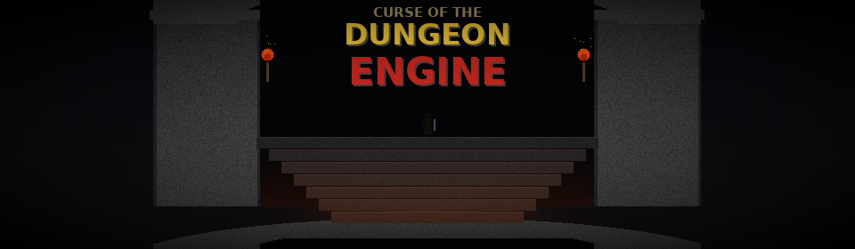

# Curse of the Dungeon Engine



[](https://discord.gg/WHKx3BkS)
[](https://ko-fi.com/rethardotv)

A first-person dungeon crawler built with a custom C++17 engine, targeting Nintendo Switch and low-end PC. Inspired by **Barony** (low-poly visual style) and **Hellgate: London** (real-time combat, loot, and skills).

## Features

- **8 playable classes** — Warrior, Ranger, Sorcerer, Rogue, Paladin, Combat Engineer, Marksman, Tinkerer — each with 4 unique skills
- **Loot system** — randomized items with tiered rarities (Common, Magic, Rare, Legendary) and 13 affix types
- **Legendary skills** — Frozen Orb, Chain Lightning, Meteor Strike, Blood Nova, Phase Dash, and more tied to legendary gear
- **Procedural dungeons** — BSP-generated levels with room-based enemy encounters
- **Tactical enemy AI** — squad coordination, A* pathfinding, flanking, retreating, ambush tactics
- **2-player local split-screen** — horizontal or vertical split on any platform
- **4-player online multiplayer** — listen-server with client-side prediction and server reconciliation
- **Nintendo Switch support** — docked (1080p) and handheld (720p) modes with gyro aiming and controller support

## Building

### Requirements

- CMake 3.16+
- A C++17 compiler (GCC, Clang, or MSVC)
- SDL2 (fetched automatically if missing)

### PC — Debug

```bash
cmake -B build -DCMAKE_BUILD_TYPE=Debug
cmake --build build
./build/DungeonEngine
```

### PC — Release

```bash
cmake -B build-rel -DCMAKE_BUILD_TYPE=Release
cmake --build build-rel
./build-rel/DungeonEngine
```

If SDL2 is not found, run `./fetch_sdl2.sh` first to pull it as a submodule.

### Nintendo Switch (Docker)

The easiest way to build for Switch is with the devkitPro Docker image — no local toolchain install needed.

**1. Pull the image**

```bash
docker pull devkitpro/devkita64
```

**2. Configure (first time only)**

```bash
docker run --rm \
  -u "$(id -u):$(id -g)" \
  -v "$(pwd)":/game -w /game \
  devkitpro/devkita64 \
  bash -c "source /opt/devkitpro/switchvars.sh && \
           cmake -B build-switch \
                 -DCMAKE_TOOLCHAIN_FILE=cmake/switch.cmake \
                 -DCMAKE_BUILD_TYPE=Release"
```

**3. Build**

```bash
docker run --rm \
  -u "$(id -u):$(id -g)" \
  -v "$(pwd)":/game -w /game \
  devkitpro/devkita64 \
  bash -c "source /opt/devkitpro/switchvars.sh && \
           cmake --build build-switch"
```

This produces `build-switch/DungeonEngine.nro` with assets bundled as romfs.

**Note:** Audio assets must be fetched on the host before building for Switch:

```bash
python3 tools/fetch_audio.py
```

### Running on a Homebrew Switch

Your Switch needs custom firmware (CFW) such as [Atmosphere](https://github.com/Atmosphere-NX/Atmosphere) with the [Homebrew Menu](https://github.com/switchbrew/nx-hbmenu) installed.

**Option A — SD card**

1. Copy `build-switch/DungeonEngine.nro` to your SD card under `switch/DungeonEngine/`
2. Insert the SD card, open the Homebrew Menu on your Switch
3. Launch **DungeonEngine**

**Option B — nxlink (network transfer)**

Send the NRO directly over Wi-Fi using `nxlink`. Your Switch and PC must be on the same network.

1. Open the Homebrew Menu on your Switch and press **Y** to start the NetLoader — it will display the Switch's IP address
2. Send the NRO from your PC:

```bash
docker run --rm \
  --network host \
  -v "$(pwd)":/game \
  devkitpro/devkita64 \
  nxlink -s /game/build-switch/DungeonEngine.nro -a <SWITCH_IP>
```

Replace `<SWITCH_IP>` with the IP shown on your Switch (e.g. `192.168.2.54`). The `-s` flag starts a debug server so stdout is forwarded to your terminal.

## Controls

| Action | Keyboard/Mouse | Gamepad |
|--------|---------------|---------|
| Move | WASD | Left stick |
| Look | Mouse | Right stick / Gyro |
| Attack | Left click | ZR |
| Skill | Right click | ZL |
| Jump | Space | B |
| Inventory | Tab | X |
| Pickup | E | A |
| Lock-on | Middle click | L |

## License

This project is **source-available** — code and assets are public, but
commercial use is restricted.

**Code** (`src/`, build files) is licensed under the
[PolyForm Noncommercial License 1.0.0](LICENSE). You may view, fork,
modify, and use the code for personal, educational, and noncommercial
purposes. Commercial use requires explicit written permission.

**Assets** (`assets/`) are licensed under
[CC BY-NC 4.0](LICENSE-ASSETS). Free for noncommercial use with
attribution required.

**Audio** — Sound effects in `assets/audio/` are sourced from CC0 (public
domain) sound packs and processed by `tools/fetch_audio.py`. Any sounds not
matched from packs are procedurally generated by `tools/gen_audio.py`.
Attribution is not required but appreciated:

- [Kenney](https://kenney.nl/) — RPG Audio, Impact Sounds, UI Audio (CC0 1.0)
- [OpenGameArt.org](https://opengameart.org/) contributors — 80 CC0 RPG SFX,
  100 CC0 SFX, 50 CC0 Retro Synth SFX, Swishes, Thwack, RPG Sound Pack,
  Magic Spell SFX (CC0 1.0)

**Third-party libraries** in `external/` retain their own licenses
(ENet: MIT, SDL2: zlib, stb: public domain). See each subdirectory.

### Commercial Licensing

To use any part of this project commercially, contact me via GitHub to
discuss a commercial license agreement.

